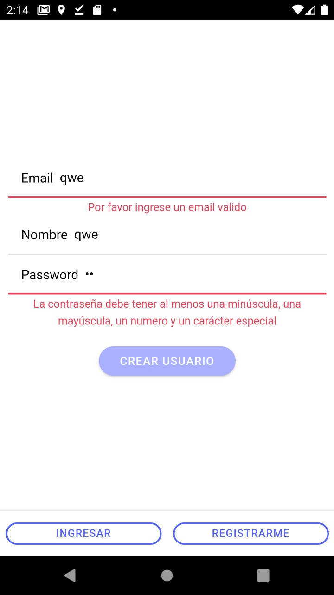

# Pelis App

## Caracteristicas generales

- Angular 11.2
- Ionic cli 6.12.4
- node v14.15.4
- Sass 4.14
- Gradle 6.8.3
- Android Api 29
-Cordova

## Instalaciones recomendadas

npm install -g @angular/cli
npm install -g @ionic/cli
npm install -g cordova

## Correrlo en la web (no recomendado)

- Clonar el proyecto
- npm install
- ionic serve

## Correrlo en un dispositivo emulado
Build
ionic cordova platform remove android
ionic build android
ionic cordova prepare android

Probada en 
- Api 29
- J7 2016
- A21S
- Moto G7
## 1 forma
Abrir la carpeta platforms - android con android studio
## 2 forma
ionic cordova run android --target=NOMBRE_DISPOSITIVO_EMULADO
## Consideraciones
la función de cambiar logo por utiliza un plugin de cordova que solo funciona de manera nativa.
los mensajes se centralizaron en un servicio, mayormente se utiliza toast y alert en esta app.
## Descripción 

Proyecto crud de películas, con autenticación de usuarios, search y rating de películas. 
Utilizo Firebase para persistir los datos y FireAuth para la autenticación de usuarios.
Utilizo Cordova para el build del proyecto en enfoque de dispositivos nativos.

## Final

   

El usuario puede logearse.

   

Si sus datos son erroneos se le permite restablecer la contraseña usando el email que ya coloco en el input, si dicho email no existe se le notifica con un toast

   

 

El usuario puede registrarse, este form tienes sus respectivas validaciones y al finalizar el registro se le envía un email para que verifique su cuenta, también se actualiza el displayName o nombre de usuario de la cuenta recién creada.

   

   

De entrada puedo visualizar las películas que son renderizadas en un componente aparte para repetirse de acuerdo al numero de registros que traiga mi servicio. En dichos componentes se encuentra el rating, cada usuario tiene su propia puntuación de películas como es esperado.

   

También puedo buscar la película que me interese a partir del titulo.

   

En el Menu left solo tengo la opcion de logout.

   

Agregar una película con su respectivas validaciones